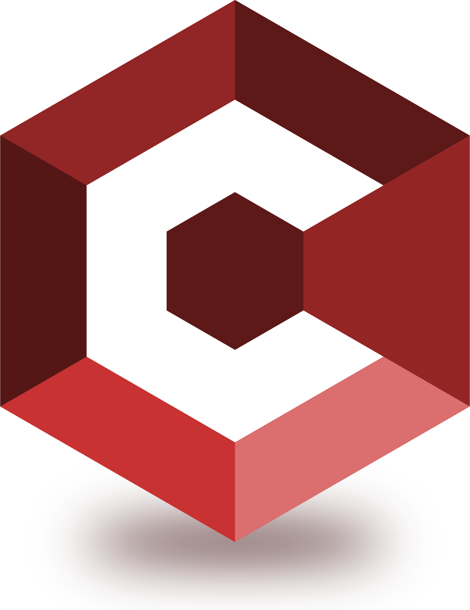

Welcome to Cambion
------------------

Cambion is a lightweight and open-source distributed application framework providing a service bus for .NET
with multiple and pluggable transports and serializers.
It also includes a set of convenience functions for synchronous and asynchronous event handling.
The framework is easily extensible to add support for other transports and serializers.

.. toctree::
   :hidden:
   :caption: Installation

   installation/nuget

.. toctree::
   :hidden:
   :caption: The Basics

   basics/instantiation
   basics/subscribing
   basics/consuming

.. toctree::
   :hidden:
   :caption: Transports

   transports/introduction
   transports/loopback
   transports/netmq

.. toctree::
   :hidden:
   :caption: Serializers

   serializers/introduction
   serializers/jsonnet
